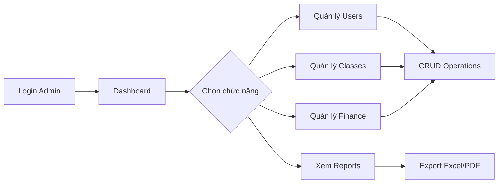
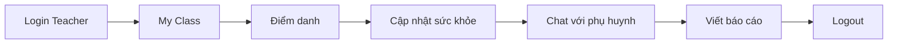
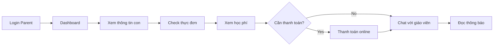
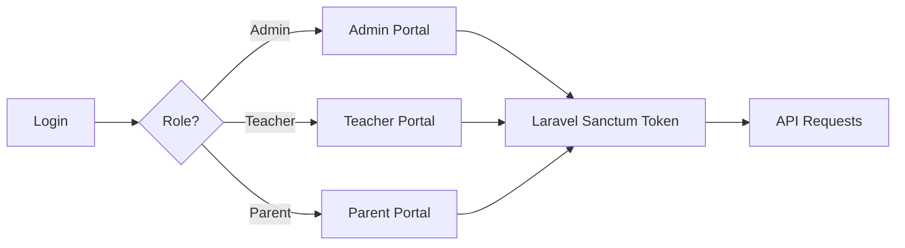

# 🎓 Hệ Thống Quản Lý Trường Mầm Non

[](https://laravel.com)
[](https://vuejs.org)
[](https://vuetifyjs.com)
[](https://php.net)
[](LICENSE)

> **Hệ thống quản lý toàn diện cho trường mầm non** - Giải pháp số hóa hoàn chỉnh giúp quản lý học sinh, giáo viên, phụ huynh, học phí, thực đơn, sức khỏe và nhiều tính năng khác một cách hiệu quả và chuyên nghiệp.

## 📖 Giới thiệu

**DATN - Hệ Thống Quản Lý Trường Mầm Non** là đồ án tốt nghiệp được phát triển với mục tiêu **số hóa toàn diện** quy trình quản lý cho các trường mầm non. Dự án kết hợp công nghệ web hiện đại (Laravel 12 + Vue 3) với trải nghiệm người dùng thân thiện, mang đến giải pháp quản lý thông minh cho nhà trường, giáo viên và phụ huynh.

### 🎯 Vấn đề giải quyết

- 📝 **Quản lý thủ công**: Hồ sơ giấy tờ rườm rà, dễ thất lạc
- 💬 **Thiếu kết nối**: Khó khăn trong giao tiếp giữa giáo viên - phụ huynh
- 💰 **Tài chính không minh bạch**: Khó theo dõi thu chi, học phí
- 🍽️ **Dinh dưỡng không rõ ràng**: Phụ huynh không biết con ăn gì hàng ngày
- 💊 **Sức khỏe thiếu theo dõi**: Không có hồ sơ y tế điện tử

### ✨ Giá trị mang lại

| Đối tượng         | Lợi ích                                                                   |
| ----------------- | ------------------------------------------------------------------------- |
| 🏫 **Nhà trường** | Quản lý tập trung, báo cáo tự động, tiết kiệm thời gian                   |
| 👨‍🏫 **Giáo viên**  | Điểm danh nhanh, chat trực tiếp với phụ huynh, lưu trữ thông tin học sinh |
| 👨‍👩‍👧‍👦 **Phụ huynh**  | Theo dõi con 24/7, thanh toán online, nhận thông báo real-time            |
| 👶 **Học sinh**   | Được chăm sóc tốt hơn nhờ hồ sơ y tế, dinh dưỡng được theo dõi            |

### 🌟 Điểm nổi bật

```
✅ 3 Portal riêng biệt (Admin, Teacher, Parent) với trải nghiệm tối ưu
✅ Chat real-time sử dụng Pusher WebSocket
✅ AI Chatbot tư vấn 24/7 powered by Groq
✅ Responsive design, hoạt động mượt mà trên mọi thiết bị
✅ Dashboard trực quan với biểu đồ tương tác (ECharts)
✅ Thanh toán online tích hợp PayOS
✅ Export dữ liệu Excel/PDF một cú click
✅ Bảo mật cao với Laravel Sanctum + Role-based access control
```

### 📊 Thống kê dự án

```
📦 Tổng số components:      100+
🎨 Số trang giao diện:      50+
🔌 API endpoints:           100+
📝 Database tables:         30+
👥 User roles:              4 (Admin, Teacher, Parent, Staff)
💬 Real-time features:      Chat, Notifications, Updates
🤖 AI Integration:          Groq SDK for chatbot
📱 Responsive breakpoints:  5 (xs, sm, md, lg, xl)
```

### 🎬 Use Cases thực tế

#### 🌅 **Buổi sáng tại trường**

```
07:00 → Giáo viên login vào Teacher Portal
07:30 → Điểm danh học sinh bằng 1 click
      → Hệ thống tự động gửi thông báo cho phụ huynh
08:00 → Cập nhật thực đơn bữa sáng
      → Phụ huynh nhận được thông tin món ăn con đang ăn
```

#### 💬 **Chat giữa giáo viên và phụ huynh**

```
Phụ huynh: "Cô ơi, hôm nay con em ăn uống thế nào?"
→ Real-time message qua Pusher
Giáo viên: "Em bé ăn rất ngoan, đã ăn hết cơm rồi ạ!"
→ Notification hiển thị ngay trên điện thoại phụ huynh
```

#### 💰 **Thanh toán học phí**

```
1. Phụ huynh vào Client Portal → Xem học phí tháng 12
2. Click "Thanh toán" → Chuyển đến PayOS
3. Quét QR code → Thanh toán thành công
4. Hệ thống tự động cập nhật trạng thái
5. Xuất hóa đơn PDF tự động gửi email
```

#### 🤖 **AI Chatbot hỗ trợ**

```
Phụ huynh: "Thực đơn ngày mai là gì?"
AI Bot: "Thực đơn ngày 15/12/2025:
        - Sáng: Phở bò + Sữa tươi
        - Trưa: Cơm gà xào + Canh chua
        - Chiều: Bánh mì pate + Nước ép cam"
```

### 🎯 Workflow chính

#### **Admin Workflow**



#### **Teacher Daily Workflow**



#### **Parent Daily Workflow**



### 🎥 Demo & Screenshots

#### **Admin Portal**

- ✨ Dashboard với real-time statistics
- 📊 Biểu đồ tương tác: Tỉ lệ điểm danh, thu chi, học sinh theo lớp
- 👥 Quản lý user với filter, search, pagination
- 💰 Báo cáo tài chính theo tháng/quý/năm

#### **Teacher Portal**

- 📚 My Class: Danh sách học sinh với ảnh, thông tin
- ✅ Điểm danh nhanh với checkbox UI
- 💬 Chat interface giống Messenger
- 📊 Progress tracking cho từng học sinh

#### **Parent Portal**

- 🏠 Homepage đẹp mắt với slider
- 📰 Blog/News section
- 🍽️ Menu calendar view
- 💳 Payment history với status badges
- 📱 Mobile-friendly design

### 💡 Công nghệ nổi bật

#### **Backend Architecture**

```
Laravel 12 (MVC Pattern)
├── Controllers (API-based)
├── Models (Eloquent ORM)
├── Migrations (Database schema)
├── Seeders (Sample data)
├── Middleware (Auth, CORS)
├── Services (Business logic)
└── Broadcasting (Real-time events)
```

#### **Frontend Architecture**

```
Vue 3 (Composition API)
├── Components
│   ├── Admin/
│   ├── Teachers/
│   └── Client/
├── Router (Vue Router)
├── State (localStorage)
├── API (Axios)
└── UI (Vuetify 3)
```

#### **Real-time Communication**

```
Pusher WebSocket
├── Private Channels (1-1 chat)
├── Presence Channels (Group chat)
├── Event Broadcasting
└── Real-time Notifications
```

### 📈 Tính năng nâng cao

| Feature                   | Công nghệ             | Mô tả                                  |
| ------------------------- | --------------------- | -------------------------------------- |
| 📊 **Interactive Charts** | ECharts 5.5           | Biểu đồ cột, tròn, đường với animation |
| 💬 **Real-time Chat**     | Pusher + Laravel Echo | Chat 1-1 và group chat instant         |
| 🤖 **AI Chatbot**         | Groq SDK              | Natural language processing            |
| 📄 **PDF Export**         | jsPDF + autotable     | Xuất hóa đơn, báo cáo                  |
| 📊 **Excel Export**       | XLSX.js               | Export data với formatting             |
| 🔐 **Authentication**     | Laravel Sanctum       | Token-based API auth                   |
| 🎨 **UI Components**      | Vuetify 3             | Material Design system                 |
| 📱 **Responsive**         | CSS Grid + Flexbox    | Mobile-first approach                  |

### 🚦 Getting Started Preview

**Sau khi cài đặt, bạn sẽ có:**

```bash
✅ Backend API running on http://localhost:8000
   - Swagger UI: http://localhost:8000/api/documentation
   - API endpoints ready to use

✅ Frontend app running on http://localhost:5173
   - Admin Portal: http://localhost:5173/admin
   - Teacher Portal: http://localhost:5173/teacher
   - Client Portal: http://localhost:5173/

✅ Sample data seeded:
   - 1 Admin account
   - 5 Teacher accounts
   - 20 Parent accounts
   - 50 Student records
   - Sample menus, notifications, classes
```

### 🎓 Học hỏi từ dự án

Dự án này sử dụng **best practices** từ:

- ✅ **Clean Code**: Naming conventions, code organization
- ✅ **RESTful API**: Chuẩn REST, HTTP methods đúng
- ✅ **MVC Pattern**: Separation of concerns
- ✅ **Component-based**: Reusable Vue components
- ✅ **Responsive Design**: Mobile-first approach
- ✅ **Security**: Input validation, XSS protection, CSRF
- ✅ **Git Workflow**: Feature branches, proper commits
- ✅ **Documentation**: README, code comments, API docs

## 🌟 Tổng quan

Dự án này là một hệ thống quản lý trường mầm non hoàn chỉnh với 3 portal chính:

- **Admin Portal**: Quản trị toàn bộ hệ thống
- **Teacher Portal**: Giáo viên quản lý lớp học và học sinh
- **Parent Portal**: Phụ huynh theo dõi con em

### 🎯 Mục tiêu dự án

- ✅ Digitalize quản lý trường mầm non
- ✅ Tăng cường tương tác giữa giáo viên và phụ huynh
- ✅ Theo dõi sức khỏe và dinh dưỡng học sinh
- ✅ Quản lý tài chính minh bạch
- ✅ AI chatbot hỗ trợ tư vấn 24/7

## 📦 Cấu trúc dự án

```
GPQLMNTT2759/
├── DATN_BE/          # Backend (Laravel 12)
│   ├── app/
│   ├── database/
│   ├── routes/
│   └── README.md     → Chi tiết backend
│
├── DATN_FE/          # Frontend (Vue 3 + Vuetify)
│   ├── src/
│   ├── public/
│   └── README.md     → Chi tiết frontend
│
├── FACEID/           # Face recognition module (Python)
│
└── README.md         # This file
```

## 🚀 Quick Start

### Prerequisites

```bash
# Backend requirements
- PHP >= 8.2
- Composer >= 2.0
- MySQL >= 8.0
- Node.js >= 18.x

# Frontend requirements
- Node.js >= 18.x
- NPM >= 9.x
```

### 1. Clone Repository

```bash
git clone https://github.com/KLTN-2025/GPQLMNTT2759.git
cd GPQLMNTT2759
```

### 2. Setup Backend

```bash
cd DATN_BE

# Install dependencies
composer install

# Configure environment
cp .env.example .env
php artisan key:generate

# Setup database
php artisan migrate --seed

# Start server
php artisan serve
# Server: http://localhost:8000
```

📖 **Xem chi tiết**: [DATN_BE/README.md](DATN_BE/README.md)

### 3. Setup Frontend

```bash
cd ../DATN_FE

# Install dependencies
npm install

# Configure environment
cp .env.example .env

# Start dev server
npm run dev
# Server: http://localhost:5173
```

📖 **Xem chi tiết**: [DATN_FE/README.md](DATN_FE/README.md)

## ✨ Tính năng chính

### 👥 Quản lý người dùng

- ✅ **Admin**: Quản trị viên với full quyền
- ✅ **Giáo viên**: Quản lý lớp học và học sinh
- ✅ **Phụ huynh**: Theo dõi thông tin con em
- ✅ **Nhân viên**: Hỗ trợ quản lý
- ✅ Phân quyền chi tiết theo chức năng

### 📚 Quản lý học vụ

- ✅ Quản lý lớp học và năm học
- ✅ Quản lý học sinh
- ✅ Điểm danh tự động
- ✅ Sổ liên lạc điện tử
- ✅ Báo cáo tiến độ học tập

### 💬 Communication

- ✅ **Chat 1-1**: Giáo viên ↔ Phụ huynh
- ✅ **Group Chat**: Chat theo lớp học
- ✅ **Real-time**: Pusher WebSocket
- ✅ **Notifications**: Thông báo real-time
- ✅ **Email**: Gửi email tự động

### 🍽️ Dinh dưỡng

- ✅ Thực đơn theo tuần/tháng
- ✅ Quản lý món ăn và bữa ăn
- ✅ Theo dõi dinh dưỡng
- ✅ Thống kê món ăn

### 💰 Tài chính

- ✅ Quản lý học phí
- ✅ Thanh toán online (PayOS)
- ✅ Lịch sử thanh toán
- ✅ Báo cáo thu chi
- ✅ Xuất hóa đơn PDF

### 💊 Sức khỏe

- ✅ Hồ sơ sức khỏe học sinh
- ✅ Theo dõi chiều cao, cân nặng
- ✅ Lịch sử khám bệnh
- ✅ Thống kê sức khỏe

### 🤖 AI Features

- ✅ Chatbot tư vấn (Groq AI)
- ✅ Tự động trả lời câu hỏi
- ✅ Tra cứu thông tin
- ✅ Hỗ trợ 24/7

### 📊 Báo cáo & Thống kê

- ✅ Dashboard tổng quan
- ✅ Biểu đồ tương tác (ECharts)
- ✅ Xuất Excel, PDF
- ✅ Thống kê đa chiều

## 🛠️ Tech Stack

### Backend

| Technology | Version | Purpose              |
| ---------- | ------- | -------------------- |
| Laravel    | 12.x    | PHP Framework        |
| PHP        | 8.2+    | Programming Language |
| MySQL      | 8.0+    | Database             |
| Sanctum    | 4.0     | API Authentication   |
| Pusher     | 7.2     | Real-time WebSocket  |
| Swagger    | 9.0     | API Documentation    |

### Frontend

| Technology | Version | Purpose              |
| ---------- | ------- | -------------------- |
| Vue.js     | 3.3     | JavaScript Framework |
| Vuetify    | 3.9     | UI Component Library |
| Vite       | 6.3     | Build Tool           |
| Axios      | 1.10    | HTTP Client          |
| ECharts    | 5.5     | Charts & Graphs      |
| Groq SDK   | 0.37    | AI Chatbot           |

### DevOps & Tools

- **Docker**: Containerization
- **GitHub Actions**: CI/CD
- **Netlify/Vercel**: Frontend hosting
- **Git**: Version control

## 📱 Screenshots

### Admin Portal

- Dashboard với biểu đồ thống kê
- Quản lý người dùng và lớp học
- Quản lý tài chính và học phí

### Teacher Portal

- Điểm danh học sinh
- Chat với phụ huynh
- Quản lý lớp học

### Parent Portal

- Trang chủ thông tin trường
- Tra cứu học phí
- Chat với giáo viên

## 🔐 Authentication Flow



## 📡 API Architecture

```
Frontend (Vue.js)
    ↓ HTTP Requests (Axios)
Backend (Laravel API)
    ↓ Database Queries
MySQL Database
    ↑ Real-time Events
Pusher WebSocket
    ↑ Notifications
Frontend (Real-time Updates)
```

## 🔒 Security Features

- ✅ **Authentication**: Laravel Sanctum token-based
- ✅ **Authorization**: Role-based access control (RBAC)
- ✅ **Input Validation**: Server-side validation
- ✅ **CORS**: Configured properly
- ✅ **XSS Protection**: Laravel built-in
- ✅ **SQL Injection**: Eloquent ORM protection
- ✅ **Password**: Bcrypt hashing
- ✅ **HTTPS**: SSL/TLS encryption (production)

## 🧪 Testing

### Backend Testing

```bash
cd DATN_BE
php artisan test
```

### Frontend Testing

```bash
cd DATN_FE
npm run test
```

## 📚 API Documentation

**Swagger UI**: `http://localhost:8000/api/documentation`

### Main Endpoints

#### Authentication

```http
POST /api/admin/login           - Admin login
POST /api/teacher/login         - Teacher login
POST /api/login                 - Parent login
```

#### Student Management

```http
GET  /api/admin/hoc-sinh/data   - Get students
POST /api/admin/hoc-sinh/create - Create student
POST /api/admin/hoc-sinh/update - Update student
```

#### Chat

```http
GET  /api/teacher/chat/conversations     - Get conversations
POST /api/teacher/chat/send-message      - Send message
GET  /api/teacher/group-chat/{id}/messages - Group messages
```

#### AI Chatbot

```http
POST /api/tu-van-ai             - Chat with AI
```

## 🚀 Deployment

### Backend (Laravel)

```bash
# Build for production
composer install --optimize-autoloader --no-dev
php artisan config:cache
php artisan route:cache
php artisan view:cache

# Deploy to server
# - VPS (DigitalOcean, Linode)
# - Cloud (AWS, Google Cloud)
# - PaaS (Heroku, Laravel Forge)
```

### Frontend (Vue)

```bash
# Build for production
npm run build

# Deploy options:
# - Netlify (recommended)
# - Vercel
# - Firebase Hosting
# - AWS S3 + CloudFront
```

## 🤝 Contributing

Dự án này là đồ án tốt nghiệp. Để contribute:

1. Fork repository
2. Create feature branch (`git checkout -b feature/AmazingFeature`)
3. Commit changes (`git commit -m 'Add some AmazingFeature'`)
4. Push to branch (`git push origin feature/AmazingFeature`)
5. Open Pull Request

## 📝 Git Workflow

```bash
# Main branches
main      - Production code
develop   - Development code
deloy     - Deployment branch

# Feature branches
feature/* - New features
bugfix/*  - Bug fixes
hotfix/*  - Production hotfixes
```

## 🐛 Known Issues

- [ ] Face recognition module cần tối ưu
- [ ] Chat group notification đôi khi delay
- [ ] Export Excel cần optimize cho data lớn

## 🔮 Future Enhancements

- [ ] Mobile app (React Native/Flutter)
- [ ] Face recognition điểm danh
- [ ] Video call giáo viên - phụ huynh
- [ ] Machine learning dự đoán sức khỏe
- [ ] Multi-language support
- [ ] Advanced analytics dashboard

## 📞 Support & Contact

**Team**: KLTN-2025  
**Repository**: [GitHub](https://github.com/KLTN-2025/GPQLMNTT2759)

### Có vấn đề?

1. Kiểm tra [Backend README](DATN_BE/README.md)
2. Kiểm tra [Frontend README](DATN_FE/README.md)
3. Xem logs: `storage/logs/laravel.log`
4. Create GitHub Issue

## 📄 License

This project is licensed under the MIT License - see the [LICENSE](LICENSE) file for details.

## 🙏 Acknowledgments

- Laravel community
- Vue.js community
- Vuetify team
- All contributors

---

<div align="center">

**Made with ❤️ by KLTN-2025 Team**

⭐ Star this repo if you find it helpful!

</div>
